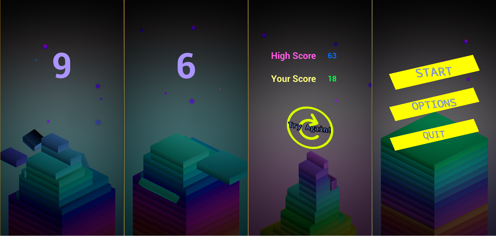

# UnrealStackGame
A game where timing is important to making a tower of blocks, based on the popular game, "Stack". It includes custom vector animations for the menus, varied difficulties, and particle effects. If you'd like to see a demonstration, check it out [here]()

This is currently being developed in Unreal Engine 4.21

You can check it out on the [Google Play Store](https://play.google.com/store/apps/details?id=com.GeekTechnique.InfinityStack)

